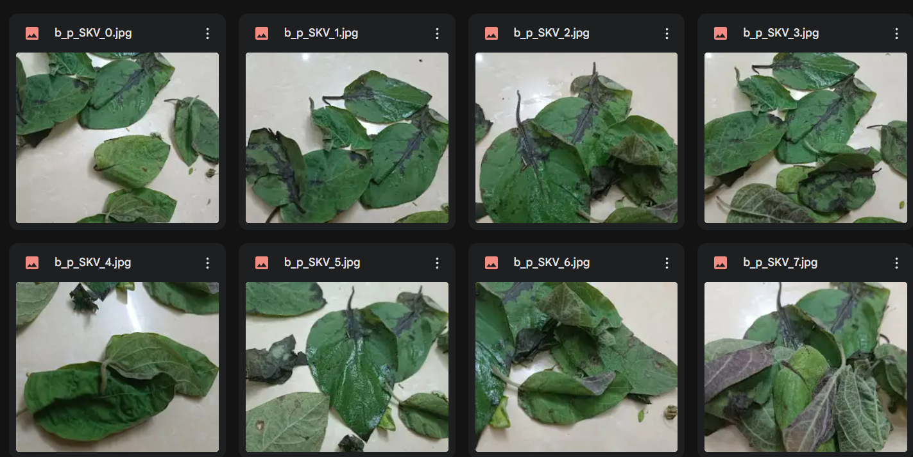
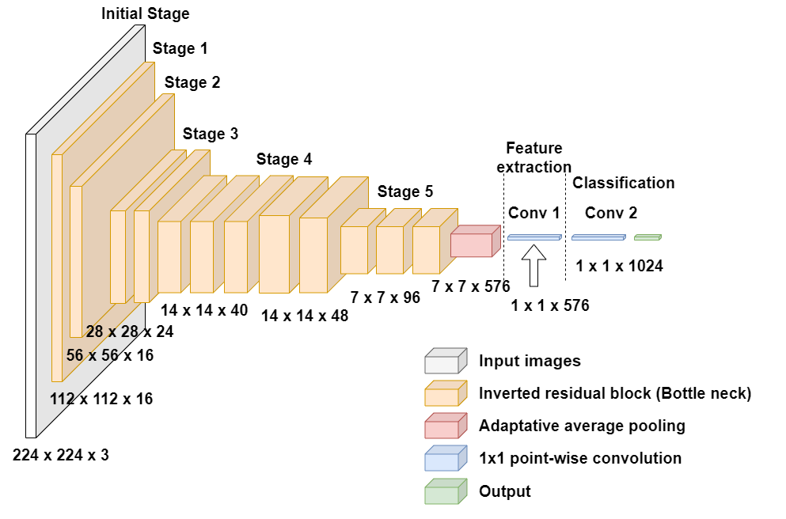
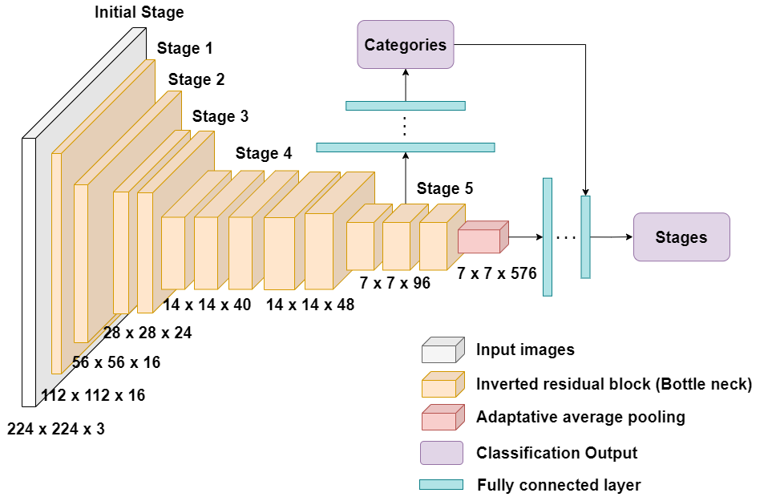
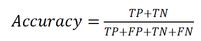
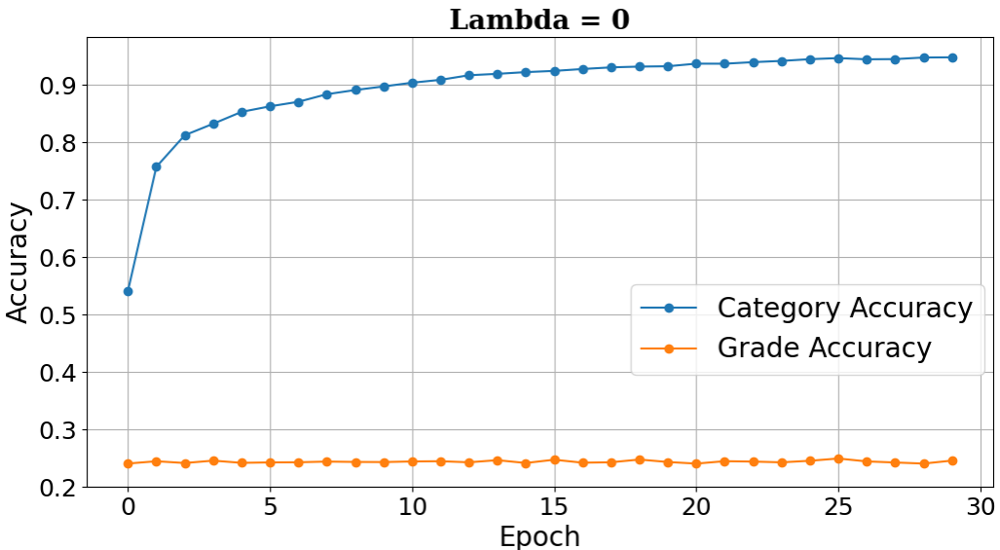
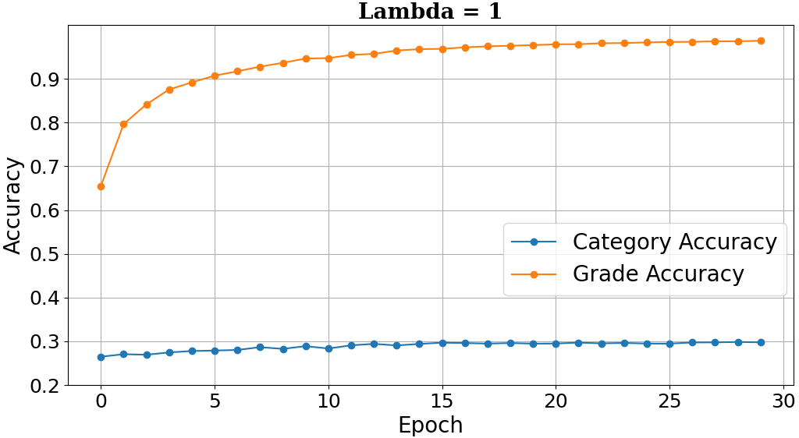
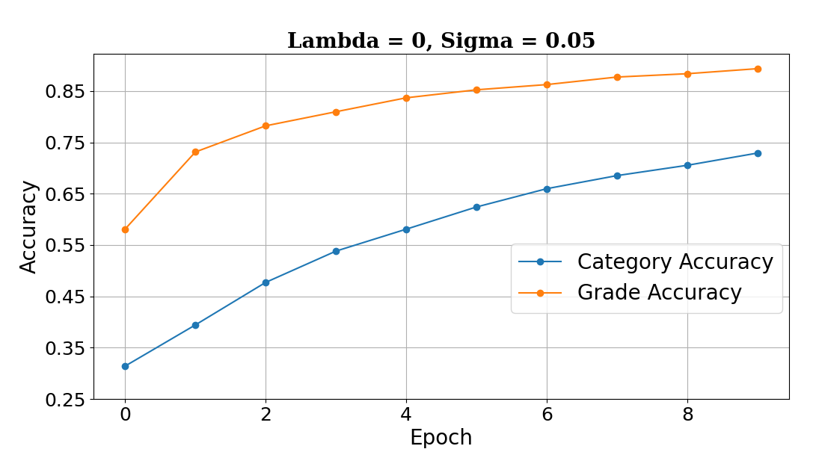
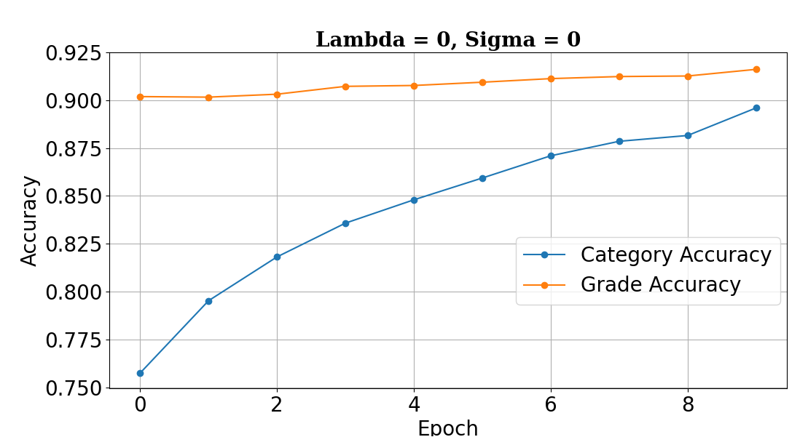

# Recognizing Vietnamese Vegetable Varieties and Quality using a Modified Hierarchical Classification and Multi-task Learning

Ngo Van Tuan Anh, Nguyen Trung Dung, Ta Uyen Nhi, Phan Duy Hung

### Abstract 
Vegetables are very diverse, so distinguishing them is not easy for many people. In addition, the quality of vegetables is also an important information which makes the identification task even more complicated.. In this work, we have collected and labeled a dataset of Vietnamese vegetable images ourselves. This dataset contains approximately 7,400 images of 6 plant species and 3 quality grades levels. We recommend the use of a Hierarchical Multi-task Learning that concurrently discerns various types of vegetables and assesses their grades quality, while comparing this method against the traditional convolutional neural networks used for classification problem and quality evaluation. Experimental results show that the proposed model significantly outperforms traditional classification models in both accuracy and robustness, demonstrating its effectiveness for vegetable type identification and quality grading.

## 1. Introduction
Vietnam has a wide variety of herbs, vegetables, and fruits; each of them has unique characteristics and quality appearance. This diversity makes it difficult to identify and evaluate the quality or the condition of them. Not only do foreigners face this difficulty, but Vietnamese residents do as well, especially when selecting vegetables at the market. The motivation of this research is to develop an efficient system that can precisely classify Vietnamese vegetables and assess their quality. 

## 2. Proposed method
### 2.1 Data Collection and preparation
Vietnamese herbs and vegetables are assembled from three main sources: images crawled from the internet, images captured using smartphone cameras, and frames extracted from videos. Some keywords used for crawling encompass terms such as “Piper lolot”, “Shiso”, “water morning glory”, and others. Specifically, we use a smartphone camera to record videos of the vegetables and then use editing apps to extract frames from these videos, sampling one image per 10 to 20 frames to ensure the images are sufficiently different from each other. After collecting a large number of photos, the data will be cleaned and augmented. Before labeling, all images are resized to 224x224 pixels.

Finally, the dataset has about 7434 images divided into 6 classes of vegetables and 3 classes of qualities

### 2.2 Model
In this approach, we use pre-trained MobileNetV3-Small which is a reasonable choice since it is lighter but remains outperform MobileNetV2. The pre-trained model is loaded from Tensorflow packages, then removes the last two 1x1 convolution layers.

Multi-task classification is usually used in merging multiple models that classify similar types of objects instead of implicit training several models. Multi-task learning may help to enhance performance by sharing information across the model. If the tasks are well-chosen, relevant features and correlated parameters could benefit overall accuracy.

The integrated Cost function mitigates the impact of errors when the model incorrectly predicts the grade of a vegetable, as opposed to misclassifying a class in a flat classification. Lambda (λ) is a hyperparameter for flexible control of the Cost function, allowing us to determine the severity of mistakes made in the grading task and balance the cost from category classification tasks with the cost from quality grading tasks.

### 2.3 Training method
To acquire the advantage of hierarchical learning, we need to train the Category Classification Task first because the model needs to successfully predict the label of the vegetable category before grading it. To accomplish the task, we can set both λ and σ to 0 and subsequently fit the MTHL model with the train data for a few epochs. Next, we train the model to understand the relationship between category and grade by setting λ to 0 and assigning a higher-than-zero value to σ, while concurrently using a relatively small learning rate. The step above can be skipped under some circumstances where it is not strictly required for the model to accurately predict both labels at the same time. Finally, adjust λ and σ freely during the final training phase to achieve the highest possible accuracy. This step demands considerable effort to fine-tune these two hyperparameters for optimal model performance.

## 3. Experiment
### 3.1 Multitask Learning Analysis
Our evaluation is based on the accuracy of the model, the accuracy is defined as:

When using Multi-task Learning, each task can be learned independently. To achieve this, we can set σ to 0, allowing the model to focus on one task at a time. Then, adjust λ from 0 to explicitly learn the vegetable Category Classification task or set λ to 1 to focus on the Grading Task. 

The findings above suggest that every task can be learned independently, particularly in cases where there's a lack of data information in either task. For example, when we only have species categorical data without the quality of each species, it is feasible for us to train the category classification task first and then train the grading task when we gather enough quality grades data information.

### 3.2 Hierarchical Learning Analyst
When λ is set to 1, the Category Classification Task benefits from indirect learning, with the category accuracy gradually increasing to around 0.3. This is notably higher than the random guessing accuracy of approximately 0.25, indicating a relationship between the features used for grading and those used for categorization.

Conversely, when λ is set to 0, the grading accuracy is slightly lower than random guessing and does not change over time. This can be explained by the fact that there is no learned relation between Category and Grading when initializing the model.

a) Accuracy of Category Classification and Grading Task accuracy over epoch when setting λ=0, σ = 0.05

b) Accuracy of Category Classification and Grading Task accuracy over epoch when setting λ=0, σ = 0

In order to better understand the effect of Category on Grade, we pre-train the model with σ = 0.05,  λ=0 for 10 epochs to establish a connection between Grade and Category. After that, we continued training the MTHL model with σ = 0 and λ = 0 for another 10 epochs and examined the change in grading accuracy. Grading accuracy slightly increases along with the Category accuracy after creating a connection between Grading Task and Category Task.

### 3.3 Multitask Learning Analysis
The result after training is summarized in the table below. “Flat_Model_18” denoted a conventional classification model with 18 outputs corresponding to 18 classes such as Good Piper Lolot, Average Piper Lolot, Good Perilla, Average Perilla, etc. The “MTHL_6_3” refers to a Multi-Task Hierarchical Learning model, which has Category Classification Task with 6 outputs corresponding to 6 species of vegetable and 3 Grading outputs (Good, Bad, and Average).

Overall Accuracy is the accuracy when both species and quality stages labels are correctly predicted. Category Accuracy and Grade Accuracy refer to accuracy for each task individually. Trainable Parameters show us the complexity of the model.

The MTHL model used a special training method proposed in above part. After training, The MTHL slightly outperformed the Flat Model in Overall Accuracy and Grade Accuracy but there was significant performance gap in Category Accuracy. Additionally, the proposed model has significantly fewer trainable parameters, indicating its lightweight property.

| Model     | Overall Accuracy   | Category Accuracy     |     Grade Accuracy     | Trainable Parameters| 
|-----------------------|------------|------------|------------|------------|
| **MTHL_6_3**    | **0.8990**       | **0.9756**       | **0.9188** | **4.045.503**     | 
| Flat_Model_18    | 0.8755       | 0.9450       | 0.9079 | 5.679.959     | 

## 4. Conclusion
This study proposes an effective approach to the problem of identifying the type and quality of Vietnamese vegetables. The overall mission can be divided into several sub-missions. This reduces the number of neurons within the output layer resulting in a reduction in the weights that need to be learned compared to using a hot encoder for the output layers in conventional CNNs. Each task can be trained separately when needed or when data is insufficient.

The modified MTHL model requires a lot of effort to maximize its performance for each different dataset with their identical hierarchical relationship. Because the model introduces two additional hyperparameters (λ, σ) and a depth parameter that determines where to concatenate the outputs of one task into the hidden layer of another task. Combined with the training method, this approach increases the complexity of the training process.

The modified MTHL model performs better than the Flat model in both overall task and individual sub-task performance. The Category Accuracy, Overall Accuracy, and Grade Accuracy consistently outperform the conventional model, while remaining lightweight and robust, underscoring the advantages of the proposed model approach in Vietnamese vegetable species classification and addressing grading problems on mobile devices.

Further research is essential to optimize the hyperparameters (λ and σ) and refine the depth parameter to maximize the model's effectiveness. This ongoing investigation aims to widen the performance gap, particularly in metrics such as Overall_Accuracy and Grade_Accuracy, thus advancing the state-of-the-art in vegetable classification and quality grading.
